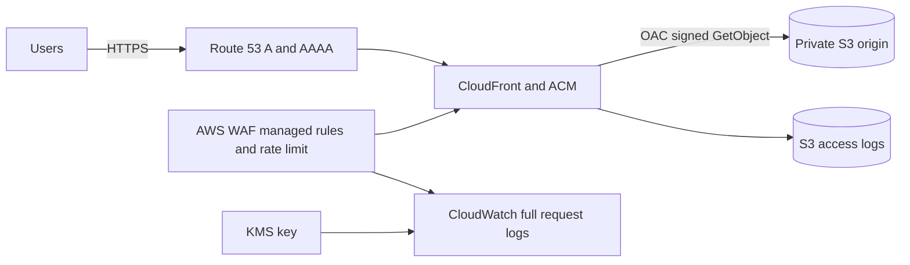

# aws.modules.blueprint-edge-web-app

A secure, production-oriented AWS edge blueprint for a static web application or single-page application. One module call composes a private versioned S3 origin, CloudFront Origin Access Control, a validated ACM certificate, AWS WAF managed rules and rate limiting, encrypted WAF request logs, CloudFront access logs, and Route 53 A/AAAA aliases.

The caller's default AWS provider remains in the workload region. The blueprint places the CloudFront certificate, WAF, WAF log group, and WAF-log KMS key in `us-east-1` through resource-level region placement required by those global services. Requires Terraform `>= 1.7.0, < 2.0.0` and AWS provider `>= 6.35.0, < 7.0.0`.

## Quick start

```hcl
provider "aws" {
  region = "us-east-2"
}

module "storefront" {
  source = "git::https://github.com/hatan4ik/aws.modules.blueprint-edge-web-app.git?ref=<immutable-commit-sha>"

  name       = "storefront"
  account_id = "123456789012"
  buckets = {
    origin      = "storefront-assets-123456789012"
    access_logs = "storefront-cloudfront-logs-123456789012"
  }
  domain = {
    name      = "app.example.com"
    zone_name = "example.com"
    zone_id   = "Z0123456789ABCDEFGHIJ"
  }
  tags = {
    Environment = "production"
    Owner       = "web-platform"
  }
}
```

You provide an existing public Route 53 hosted zone and globally unique bucket names. The module deliberately does not own the zone, application build, content upload, deployment invalidation, backend APIs, authentication, or Terraform state.

## Architecture



The origin bucket policy admits only the exact CloudFront distribution ARN, denies plaintext transport, and denies unencrypted uploads. Both buckets are private, encrypted with S3-managed AES-256, and versioned. CloudFront log delivery still requires an ACL-enabled destination, so only the access-log bucket uses `BucketOwnerPreferred` plus a private ACL; public access remains blocked.

See [docs/DESIGN.md](docs/DESIGN.md) for ownership, dependency ordering, security boundaries, failure modes, and upgrade rules.

## Operational flow

1. Platform code calls the blueprint from an environment root with an immutable commit SHA.
2. `terraform plan` validates the AWS account, hosted-zone boundary, aliases, and WAF limits.
3. `terraform apply` creates the buckets, certificate validation records, security controls, distribution, exact origin policy, and finally DNS aliases.
4. Application CI uploads immutable assets to `origin_bucket.id` and creates a CloudFront invalidation or changes versioned asset names.
5. Operators use `distribution`, `web_acl`, and log outputs for monitoring and incident response.

`force_destroy` is false by default. Destruction therefore stops rather than deleting retained object versions; disposable environments must opt in deliberately.

## Security and availability baseline

- TLS-only public endpoint with ACM-managed renewal and CloudFront's secure viewer policy from the leaf module.
- No public S3 origin; CloudFront OAC is scoped by `AWS:SourceArn` to one distribution.
- United States-only viewer allowlist by default; widen `geo_restriction` explicitly for an approved audience.
- AWS WAF Common, Known Bad Inputs (including Log4j patterns), and Amazon IP Reputation managed groups, plus a per-IP rate limit.
- Full WAF request logs retained for 365 days in a customer-managed KMS key; `authorization` and `cookie` fields are redacted.
- CloudFront standard access logs retained for 365 days in a separate bucket.
- Dual-stack Route 53 aliases and CloudFront's global edge network.
- Account and hosted-zone preconditions fail before a wrong-account or cross-zone deployment.

This is an edge/static-site blueprint, not a multi-region application backend. Availability of an API, Cognito, databases, and regional failover must be designed in their own workload composition.

## Examples

| Example | Purpose |
| --- | --- |
| [minimal](examples/minimal) | Required inputs with platform defaults. |
| [complete](examples/complete) | Additional aliases, customized WAF rate limit, price class, retention, and tags. |

## Verification

`make check TEST_TERRAFORM="TFENV_TERRAFORM_VERSION=1.8.5 terraform"` runs formatting, initialization and validation, TFLint, six mocked contract tests, documentation drift checks, Checkov, and Trivy. Tests need Terraform 1.8 or later because they override child modules; consumers remain compatible with Terraform 1.7 and CI validates that floor separately. Tests use a mocked provider and create no AWS resources.

<!-- BEGIN_TF_DOCS -->
## Requirements

| Name | Version |
|------|---------|
| <a name="requirement_terraform"></a> [terraform](#requirement\_terraform) | >= 1.7.0, < 2.0.0 |
| <a name="requirement_aws"></a> [aws](#requirement\_aws) | >= 6.35.0, < 7.0.0 |

## Providers

| Name | Version |
|------|---------|
| <a name="provider_aws"></a> [aws](#provider\_aws) | >= 6.35.0, < 7.0.0 |
| <a name="provider_terraform"></a> [terraform](#provider\_terraform) | n/a |

## Modules

| Name | Source | Version |
|------|--------|---------|
| <a name="module_access_logs_bucket"></a> [access\_logs\_bucket](#module\_access\_logs\_bucket) | git::https://github.com/hatan4ik/aws.modules.s3.git | d71da6cd3a3a13bb5fba896c4b1b67da9674b2f9 |
| <a name="module_certificate"></a> [certificate](#module\_certificate) | git::https://github.com/hatan4ik/aws.modules.acm.git | b42bd50a7c53444dfbd7c6c9a86581c19988f1b5 |
| <a name="module_distribution"></a> [distribution](#module\_distribution) | git::https://github.com/hatan4ik/aws.modules.cloudfront.git | 4a272fa6e74f739ef8ad409b9bac490da463a733 |
| <a name="module_dns"></a> [dns](#module\_dns) | git::https://github.com/hatan4ik/aws.modules.route53.git//modules/records | cf1cfadeac17bfc0a7a8bdb502d3ea3228160d1d |
| <a name="module_origin_bucket"></a> [origin\_bucket](#module\_origin\_bucket) | git::https://github.com/hatan4ik/aws.modules.s3.git | d71da6cd3a3a13bb5fba896c4b1b67da9674b2f9 |
| <a name="module_origin_bucket_policy"></a> [origin\_bucket\_policy](#module\_origin\_bucket\_policy) | git::https://github.com/hatan4ik/aws.modules.s3.git//modules/bucket-policy | d71da6cd3a3a13bb5fba896c4b1b67da9674b2f9 |
| <a name="module_waf"></a> [waf](#module\_waf) | git::https://github.com/hatan4ik/aws.modules.waf.git | 78c2fc650b8c803586ab4f1a9295056c8235db4c |
| <a name="module_waf_log_key"></a> [waf\_log\_key](#module\_waf\_log\_key) | git::https://github.com/hatan4ik/aws.modules.kms.git | a7578fe29325840faad31bd7bd52cbf71a6f233f |

## Resources

| Name | Type |
|------|------|
| [aws_cloudwatch_log_group.waf](https://registry.terraform.io/providers/hashicorp/aws/latest/docs/resources/cloudwatch_log_group) | resource |
| [aws_s3_bucket_acl.cloudfront_logs](https://registry.terraform.io/providers/hashicorp/aws/latest/docs/resources/s3_bucket_acl) | resource |
| [aws_s3_bucket_policy.origin](https://registry.terraform.io/providers/hashicorp/aws/latest/docs/resources/s3_bucket_policy) | resource |
| [terraform_data.blueprint_contract](https://registry.terraform.io/providers/hashicorp/terraform/latest/docs/resources/data) | resource |
| [aws_caller_identity.current](https://registry.terraform.io/providers/hashicorp/aws/latest/docs/data-sources/caller_identity) | data source |
| [aws_region.current](https://registry.terraform.io/providers/hashicorp/aws/latest/docs/data-sources/region) | data source |

## Inputs

| Name | Description | Type | Default | Required |
|------|-------------|------|---------|:--------:|
| <a name="input_access_log_retention_days"></a> [access\_log\_retention\_days](#input\_access\_log\_retention\_days) | Days CloudFront standard access logs remain in S3. | `number` | `365` | no |
| <a name="input_account_id"></a> [account\_id](#input\_account\_id) | Twelve-digit AWS account ID. It scopes the WAF-log KMS policy and is verified against the active provider identity. | `string` | n/a | yes |
| <a name="input_buckets"></a> [buckets](#input\_buckets) | Globally unique S3 bucket names for private application content and CloudFront standard access logs. | <pre>object({<br/>    origin      = string<br/>    access_logs = string<br/>  })</pre> | n/a | yes |
| <a name="input_domain"></a> [domain](#input\_domain) | Route 53 zone and CloudFront aliases. Every alias must be the zone apex, a child of it, or a wildcard child. | <pre>object({<br/>    name                      = string<br/>    zone_name                 = string<br/>    zone_id                   = string<br/>    subject_alternative_names = optional(set(string), [])<br/>  })</pre> | n/a | yes |
| <a name="input_force_destroy"></a> [force\_destroy](#input\_force\_destroy) | Allow destroy to empty both buckets, including object versions. Keep false outside disposable environments. | `bool` | `false` | no |
| <a name="input_geo_restriction"></a> [geo\_restriction](#input\_geo\_restriction) | CloudFront geographic access boundary. The secure platform default admits viewers in the United States only; explicitly widen it when the application's approved data-residency and threat model allows additional countries. | <pre>object({<br/>    restriction_type = optional(string, "whitelist")<br/>    locations        = optional(set(string), ["US"])<br/>  })</pre> | `{}` | no |
| <a name="input_name"></a> [name](#input\_name) | Stable application name used for CloudFront, WAF, KMS, logs, and tags. | `string` | n/a | yes |
| <a name="input_price_class"></a> [price\_class](#input\_price\_class) | CloudFront edge footprint. PriceClass\_100 covers the US, Canada, and Europe. | `string` | `"PriceClass_100"` | no |
| <a name="input_spa_error_rewrites"></a> [spa\_error\_rewrites](#input\_spa\_error\_rewrites) | Rewrite S3 403 and 404 responses to /index.html with 200 for a client-routed single-page application. | `bool` | `true` | no |
| <a name="input_tags"></a> [tags](#input\_tags) | Ownership and allocation tags applied across every composed module and glue resource. | `map(string)` | `{}` | no |
| <a name="input_waf"></a> [waf](#input\_waf) | Global WAF posture. Rate limit is requests per source IP in a trailing five-minute window. | <pre>object({<br/>    rate_limit = optional(number, 2000)<br/>    managed_rule_groups = optional(map(object({<br/>      name            = string<br/>      vendor_name     = optional(string, "AWS")<br/>      priority        = number<br/>      override_action = optional(string, "none")<br/>      })), {<br/>      common     = { name = "AWSManagedRulesCommonRuleSet", priority = 10 }<br/>      bad_inputs = { name = "AWSManagedRulesKnownBadInputsRuleSet", priority = 20 }<br/>      reputation = { name = "AWSManagedRulesAmazonIpReputationList", priority = 30 }<br/>    })<br/>  })</pre> | `{}` | no |
| <a name="input_waf_log_retention_days"></a> [waf\_log\_retention\_days](#input\_waf\_log\_retention\_days) | CloudWatch Logs retention for full WAF request logs. | `number` | `365` | no |

## Outputs

| Name | Description |
|------|-------------|
| <a name="output_access_log_bucket"></a> [access\_log\_bucket](#output\_access\_log\_bucket) | CloudFront standard access-log bucket. |
| <a name="output_certificate_arn"></a> [certificate\_arn](#output\_certificate\_arn) | Validated us-east-1 ACM viewer certificate ARN. |
| <a name="output_distribution"></a> [distribution](#output\_distribution) | CloudFront identifiers for deployments, invalidations, monitoring, and incident response. |
| <a name="output_dns_record_fqdns"></a> [dns\_record\_fqdns](#output\_dns\_record\_fqdns) | Route 53 A and AAAA alias record FQDNs keyed by stable record key. |
| <a name="output_origin_bucket"></a> [origin\_bucket](#output\_origin\_bucket) | Private origin bucket identity used by the application asset pipeline. |
| <a name="output_url"></a> [url](#output\_url) | Canonical HTTPS application URL. |
| <a name="output_web_acl"></a> [web\_acl](#output\_web\_acl) | Global WAF identity and full-request log destination. |
| <a name="output_workload_region"></a> [workload\_region](#output\_workload\_region) | Region of the default AWS provider, which owns both S3 buckets. |
<!-- END_TF_DOCS -->
